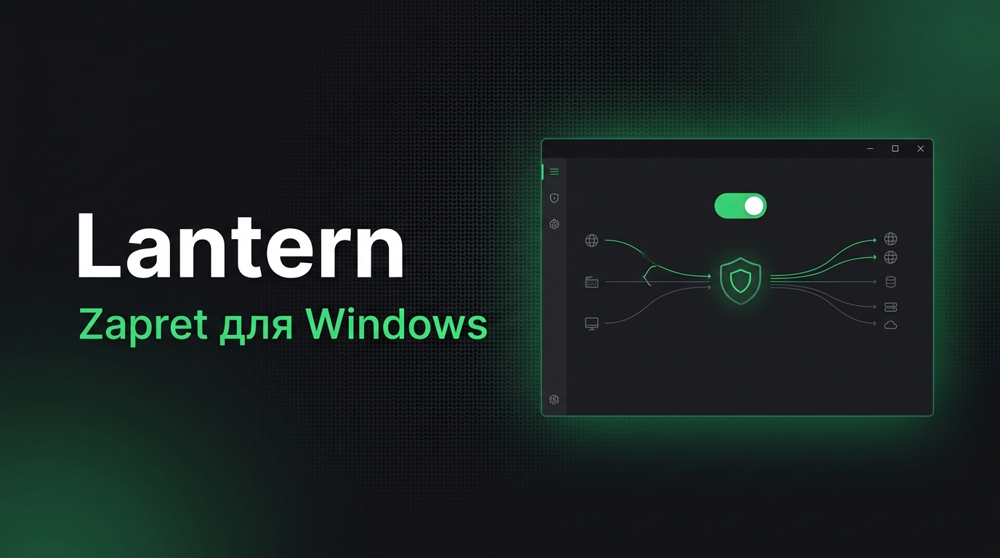

<div align="center">


# Lantern

### ⚡ Обход блокировок Discord и YouTube в один клик

<br>


<br>

[**Скачать**](https://github.com/krinix1337/lantern-zapret/releases/latest) · [Исходный код](https://github.com/krinix1337/lantern-zapret/tree/master/_app) · [Все релизы](https://github.com/krinix1337/lantern-zapret/releases)

</div>

<br>

<a id="main"></a>

### Lantern - легкий GUI-менеджер для [zapret](https://github.com/bol-van/zapret) и `winws.exe`. Он запускает обход DPI-блокировок, помогает подобрать стратегию, проверяет доступность сервисов и показывает реальные события работы.

> Весь интерфейс написан на C# и WPF без XAML. Lantern использует существующие стратегии zapret и не меняет их внутреннюю логику.

<div align="center">



[Главное](#main) · [Темы](docs/themes.md) · [Установка](#installation)

</div>

---

## ✨ Возможности

| Возможность | Что делает |
| --- | --- |
| ⚡ **Запуск в один клик** | Старт, стоп и перезапуск `winws.exe` с выбором стратегии из 20+ готовых `.bat` |
| 🔎 **Проверка стратегий** | Проверка реальных целей через HTTP/1.1, TLS 1.2 и TLS 1.3 |
| 📦 **Автообновление** | zapret и TG Proxy скачиваются из GitHub прямо в приложении |
| 🛠️ **Служба Windows** | Установка `winws.exe` как службы для автозапуска вместе с системой |
| ⭐ **Избранное** | Рабочие стратегии отмечаются звездочкой и всегда остаются сверху списка |
| 📋 **Логи** | Просмотр событий `winws.exe` в реальном времени с цветовой индикацией |
| 🎨 **Пять тем** | Тёмная, AMOLED, светлая, «Северное сияние» и «Питер Гриффин» — без перезапуска приложения |
| 🔄 **Проверка обновлений** | При запуске проверяются zapret, Telegram Proxy и Lantern; результат остаётся в настройках |

---

## 🎨 Темы Lantern 4.0

Главный экран и описание каждой из пяти тем вынесены на отдельную страницу: [посмотреть темы](docs/themes.md).

Подробное описание всех разделов интерфейса и их работы: [руководство по Lantern](docs/guide.md).

---

<a id="installation"></a>

## 🚀 Установка

1. 📥 Скачайте **`Lantern-Setup.exe`** со [страницы релизов](https://github.com/krinix1337/lantern-zapret/releases/latest).
2. 🧩 Запустите установщик и завершите установку.
3. ✨ При первом запуске Lantern скачает zapret автоматически.

> **Примечание:** TG Proxy для ускорения Telegram можно скачать в разделе **Настройки**.

> **Важно:** для работы `winws.exe` и WinDivert требуются права администратора.

---

## 🧑‍💻 Сборка из исходников

```bat
cd _app
build.cmd
```

После сборки в папке `_app` появится `zapret.exe`. При необходимости его можно переименовать в `Lantern.exe`.

Для сборки используется `csc.exe` из .NET Framework 4.0. Дополнительные инструменты устанавливать не нужно.

---

## 🗂️ Структура проекта

```text
_app/               Исходный код приложения на C# и WPF
├── Core.*.cs       Ядро: процессы, сеть, конфиг, загрузка и TG Proxy
├── View.*.cs       Страницы: обзор, стратегии, проверка, настройки и другое
├── MainWindow.cs   Главное окно и навигация
├── build.cmd       Сборка через csc.exe
└── app.ico         Иконка приложения

_installer/         Inno Setup 6
└── Lantern.iss     Скрипт сборки установщика
```

---

## 📌 Требования

- 🪟 **Windows 10** или новее
- 🧩 **.NET Framework 4.0** - уже встроен в Windows
- 🛡️ **Права администратора** - нужны для работы WinDivert

---

## 🙌 Благодарности

| Проект | Описание |
| --- | --- |
| [bol-van/zapret](https://github.com/bol-van/zapret) | DPI bypass multiplatform |
| [Flowseal/zapret-discord-youtube](https://github.com/Flowseal/zapret-discord-youtube) | Стратегии и списки для Discord и YouTube |
| [Flowseal/tg-ws-proxy](https://github.com/Flowseal/tg-ws-proxy) | Ускорение Telegram Desktop |

---

<div align="center">

**MIT License** - [LICENSE.txt](LICENSE.txt)

</div>
