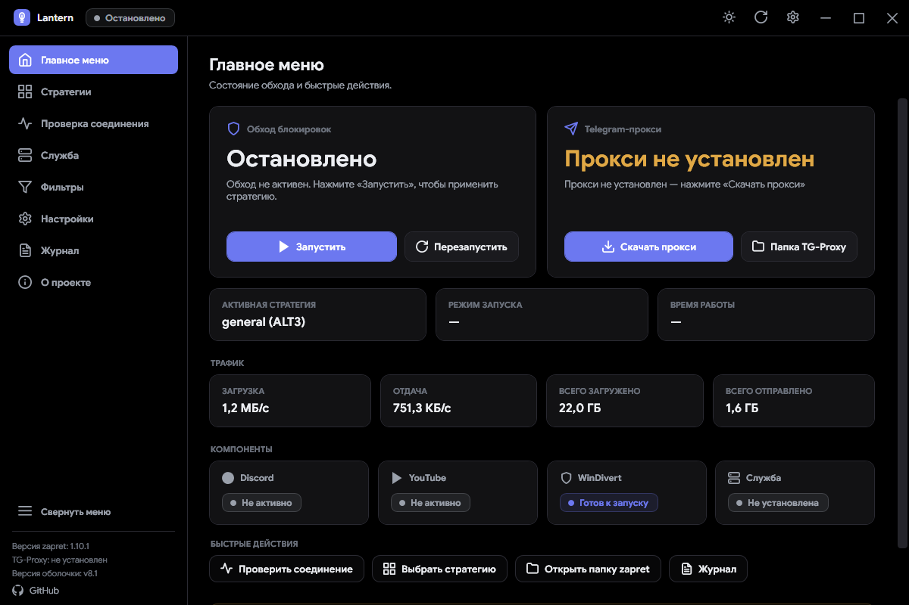
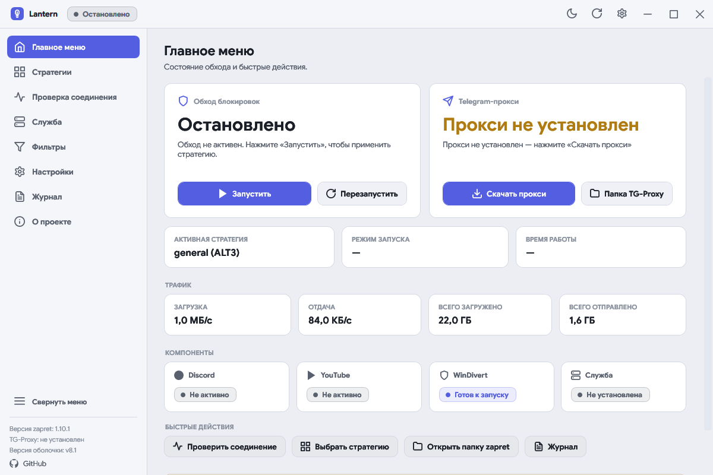
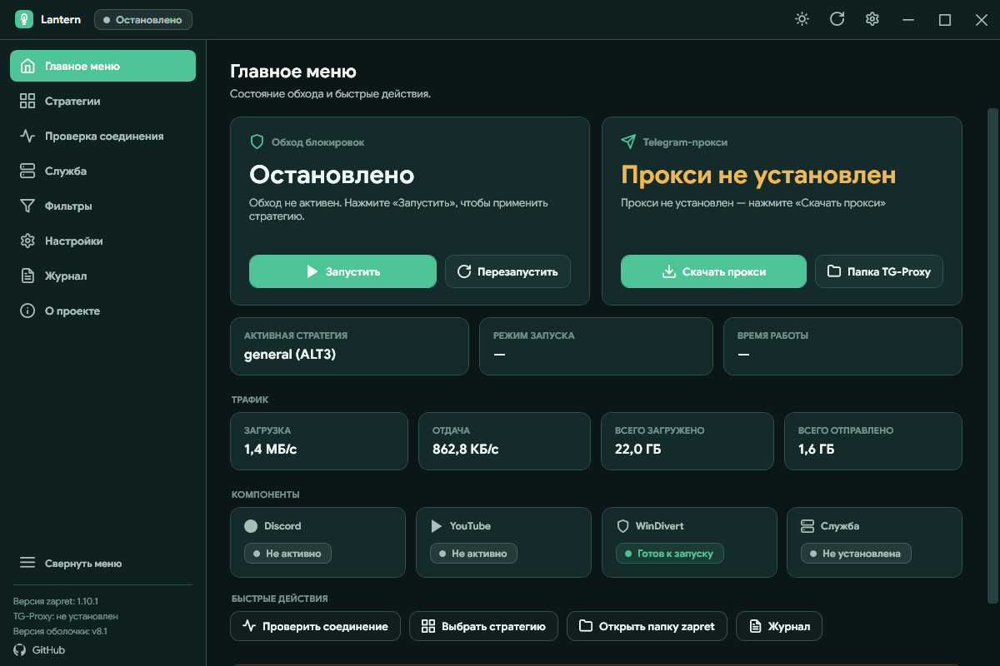
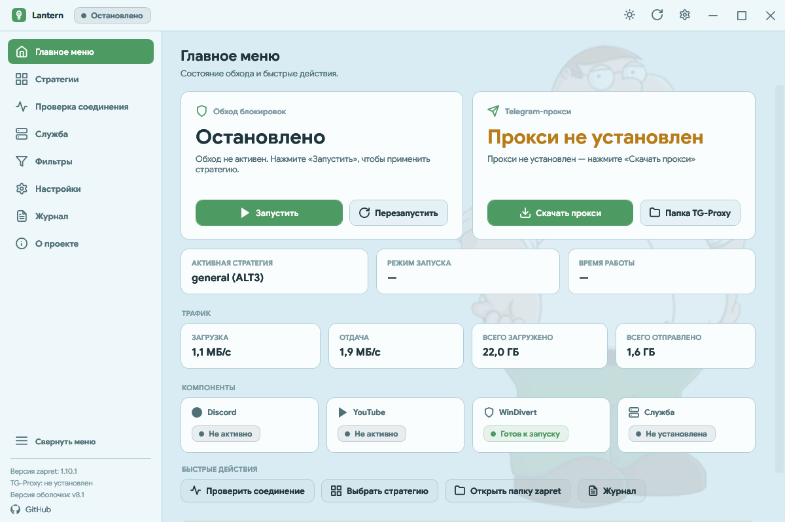

# 🎨 Галерея тем оформления Lantern

### Персонализируйте внешний вид приложения под ваше окружение и настроение

 

[**🏠 Главная**](../README.md) • [**📖 Руководство**](guide.md) • [**🎨 Галерея тем**](themes.md) • [**🚀 Установка**](../README.md#-установка-и-первый-запуск) • [**⬇️ Релизы**](https://github.com/krinix1337/lantern-zapret/releases)

 

---

## ⚡ О дизайне и переключении тем

Lantern оснащён **динамической дизайн-системой**:
- 🎨 **Официальные векторные Lucide Icons**: чёткие 24×24 SVG-контуры с живыми микро-анимациями при наведении во всех темах.
- 🎵 **Интегрированный музыкальный плеер**: мини-плеер в боковой панели гармонично адаптирует свои цвета и обложки под выбранную тему.
- 🔄 **Мгновенное переключение без перезапуска**: цвета кистей (`SolidColorBrush`) мутируют на лету, плавно обновляя все элементы интерфейса.
- 🪟 **Стилизованный ScrollBar**: полоса прокрутки автоматически адаптируется под контрастность выбранной темы.
- 🌟 **Скругления DWM Windows 11**: нативные плавные углы окна и карточек.

> [!TIP]
> Выбрать тему можно в **Настройки → Интерфейс → Тема оформления** либо быстрым кликом по иконке темы (☀️ / 🌙) в правом верхнем углу окна.

---

## 📊 Сводная таблица тем

| Тема | Фон (Base) | Карточка (Surface) | Акцент (Accent) | Рекомендуемое окружение |
| :--- | :---: | :---: | :---: | :--- |
| 🌙 **Тёмная** | `#181A1F` | `#1F2228` | `#6C78F0` *(Indigo)* | Универсальная классическая тема |
| 🖤 **AMOLED** | `#000000` | `#121214` | `#6C78F0` *(Indigo)* | OLED / Mini-LED экраны, работа в темноте |
| ☀️ **Светлая** | `#F5F6FA` | `#FFFFFF` | `#535FE0` *(Cobalt)* | Яркое дневное освещение |
| 🌌 **Северное сияние** | `#0F2020` | `#152A2A` | `#4DC596` *(Mint)* | Длительная работа без усталости глаз |
| 🌅 **Закат** | `#1B1622` | `#241E2D` | `#FF6B6B` *(Coral/Peach)* | Тёплый вечерний неоновый стиль (Tokyo Night) |
| 🍗 **Питер Гриффин** | `#EEF7FA` | `#FAFDFE` | `#4D9B62` *(Green)* | Светлая тема с кастомным артом и музыкой |

---

## 🌙 1. Тёмная (Dark)

Базовая сбалансированная тема Lantern. Графитовый тёмный фон снижает нагрузку на зрение, а мягкий индиго-акцент выделяет ключевые элементы управления.

---

## 🖤 2. AMOLED (True Black)

Создана специально для OLED и Mini-LED матриц. Абсолютно черный цвет фона (`#000000`) выключает пиксели на поддерживаемых экранах, экономя заряд аккумулятора и обеспечивая максимальную контрастность.

---

## ☀️ 3. Светлая (Light)

Чистая и контрастная светлая палитра, идеально подходящая для работы при ярком естественном или офисном освещении. Карточки четко очерчены мягкими тенями и границами.

---

## 🌌 4. Северное сияние (Aurora)

Глубокая атмосферная тёмная палитра с оттенками хвойного леса и ночного неба. Изумрудно-мятный акцент и тёплые статусы делают эту тему особенно комфортной для вечернего использования.

---

## 🌅 5. Закат (Sunset / Tokyo Night)

Тёплая сумеречная тема в стиле ночного Токио: глубокий баклажаново-сливовый фон в сочетании с ярким закатным кораллово-персиковым неоном. Создаёт невероятно уютную атмосферу для вечернего гейминга и прослушивания музыки.

---

## 🍗 6. Питер Гриффин (Peter Griffin Special)

Уникальная авторская тема со светлым небесно-голубым фоном, сочными зелеными элементами и полупрозрачным фирменным бэкдропом Питера Гриффина на заднем плане.

### 🎵 Особенности темы «Питер Гриффин»:
- **Фоновая иллюстрация**: аккуратный водяной знак с Питером Гриффином в правом нижнем углу рабочей области.
- **Встроенный аудиоплеер**: возможность воспроизводить случайные культовые музыкальные треки из папки `assets/peter-songs/` прямо из настроек программы.
- **Поддержка пользовательских треков**: вы можете положить любые MP3-файлы в папку `assets/peter-songs/`, и они автоматически добавятся в ротацию.

---

[**🏠 Вернуться на главную**](../README.md) • [**📖 Перейти к руководству**](guide.md) • [**⭐ Проект на GitHub**](https://github.com/krinix1337/lantern-zapret)

